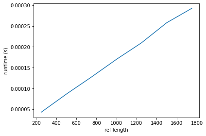
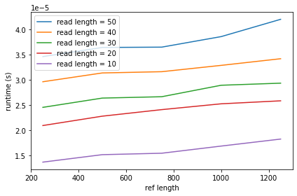

# Project 2: Suffix tree construction

You should implement a suffix tree construction algorithm. You can choose to implement the naive O(n²)-time construction algorithm as discussed in class or McCreight’s O(n) construction algorithm. After that, implement a search algorithm (similar to slow-scan) for finding all occurrences of a pattern. This algorithm should run in O(m+z) where m is the length of the pattern and z the number of occurrences.

Write a program, `st` using the suffix tree exact pattern search algorithm (similar to slow-scan) to report all indices in a string where a given pattern occurs. 

The program should take the same options as in project 1: `st genome.fa reads.fq`. The program should output (almost) the same SAM file. Because a search in a suffix tree is not done from the start to the end of the string the output might be in a different order, but if you sort the output from the previous project and for this program, they should be identical.

## Evaluation

Implement the tool `st` that does exact pattern matching using a suffix tree. Test it to the best of your abilities, and then fill out the report below.

# Report

## Specify if you have used a linear time or quadratic time algorithm.

# ANWSER:
# I have implemented the naive-ST-algorithm which is build with O(n^2)
# and searched with O(m).

## Insights you may have had while implementing and comparing the algorithms.

# ANWSER:
# That suffix trees are a magical and awesome.

## Problems encountered if any.

# ANWSER:
# That implementing something which output is hard to visualize (while 
# building/implementing) is extremely challenging. 

## Correctness/coverage

# ANWSER:
# My suffixtree-naive-algorithm was run against the naive-naive algorithm from 
# last project 500000 times on simulated random data, returning the same 
# result in all iterations (see ./src/runtime_comparison.py).

# Also, a coverage test was run using below steps 
# (https://coverage.readthedocs.io/en/6.4.4/).
# coverage run st.py ./data_for_testing/fasta.fa ./data_for_testing/fastq.fq
# coverage report -m
# All unused lines (32, 50, 107, 110-111, 125, 127, 129, 153) besides 107 is
# involved in early-return or handling None values. Line 107 is run when i 
# test my implementation manually. 

## Running time

*Describe experiments that verifies that your implementation of `st` uses no more time than O(n) or O(n²) (depending on the algorithm) for constructing the suffix tree and no more than O(m) for searching for a given read in it. Remember to explain your choice of test data. What are “best” and “worst” case inputs?*

# ANWSER (building tree):
# Below figure shows runtime as a function of n (ref length) divided by n.
# After division by n the runtimes are well described by a linear model 
# (suggesting that the original runtimes are described by a quadratic model).
#

# ANWSER (searching tree):
# Below figure shows runtimes for varying read lengths (with approx 
# same slope).
#

# NOTE: 
# I just realized that my repString function is a brain-fart-function not 
# doing what intended (at all). Ill probably have to fix this at 
# storm-troopers on Wednesday..

